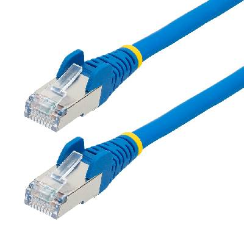
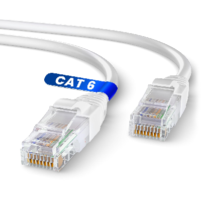
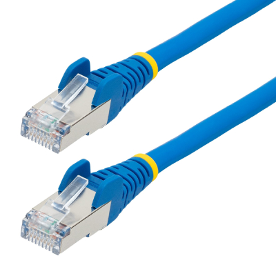
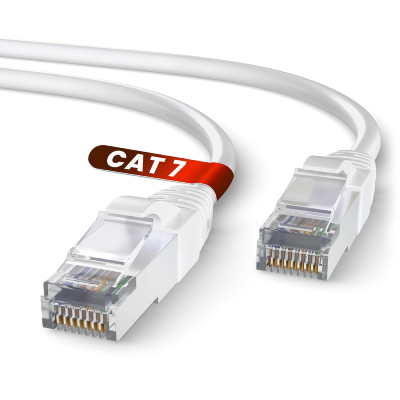
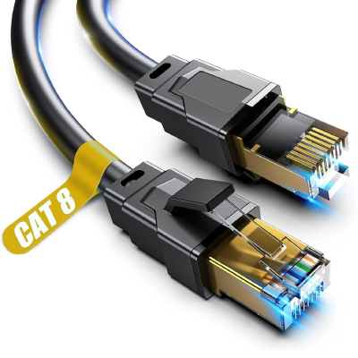
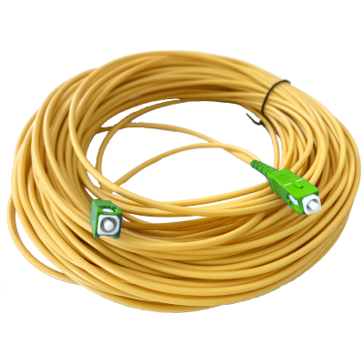
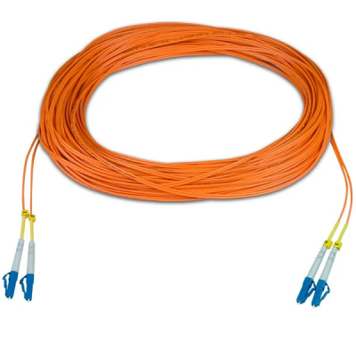
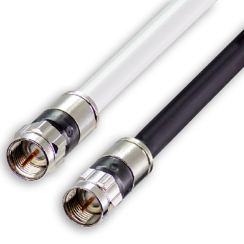
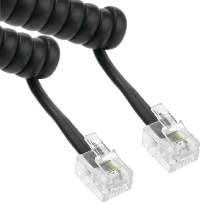
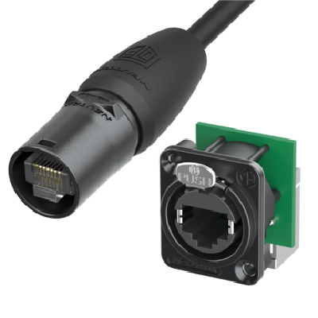

# 🧵 Cables del Mundo

Repositorio técnico y visual sobre **todos los tipos de cables utilizados en informática, redes, servidores, móviles, vídeo, audio y energía.**  
Incluye especificaciones, materiales, conectores, usos principales y estado actual de cada uno.  
Proyecto educativo inspirado por la curiosidad de comprender la capa física del mundo digital. 🌐⚡

---

## 📖 Índice
- [Cables de Red y Telecomunicaciones](#cables-de-red-y-telecomunicaciones)
- [Cables de Datos y Almacenamiento](#cables-de-datos-y-almacenamiento)
- [Cables de Vídeo](#cables-de-vídeo)
- [Cables de Audio](#cables-de-audio)
- [Cables de Energía](#cables-de-energía)
- [Cables Industriales y Servidores](#cables-industriales-y-servidores)
- [Cables Móviles y Especiales](#cables-móviles-y-especiales)

---

## 🌐 Cables de Red y Telecomunicaciones

| Imagen | Cable | Conector | Descripción | Material / Tipo | Estado / Uso actual |
|--------|--------|-----------|--------------|------------------|----------------------|
|  | Ethernet Cat5e | RJ-45 | Cable trenzado para redes LAN hasta 1 Gbps. | Cobre, par trenzado UTP/FTP | Vigente, pero en declive frente a Cat6. |
|  | Ethernet Cat6 | RJ-45 | Mejora el ancho de banda y reduce interferencias. | Cobre, UTP/STP | Muy usado en redes domésticas. |
|  | Ethernet Cat6a | RJ-45 | Hasta 10 Gbps, ideal para cableado estructurado. | Cobre, blindado | Estándar en empresas modernas. |
|  | Ethernet Cat7 | GG45 / TERA | Cable de alta frecuencia hasta 600 MHz. | Cobre, doble apantallado | Uso profesional; reemplazado por Cat8. |
|  | Ethernet Cat8 | RJ-45 | Soporta 25/40 Gbps hasta 30m. | Cobre, S/FTP | Actual estándar para centros de datos. |
|  | Fibra óptica monomodo | LC / SC / FC | Transmite datos a largas distancias con baja pérdida. | Vidrio, núcleo 9µm | Vigente en backbone y WAN. |
|  | Fibra óptica multimodo | LC / SC | Transmisión a corta/media distancia. | Vidrio o plástico, núcleo 50/62.5µm | Muy usada en redes locales. |
|  | Cable coaxial RG-6 | BNC / F-Type | Transmisión analógica o RF. | Cobre + aislamiento + malla | En uso en CCTV y antenas. |
|  | Cable telefónico RJ-11 | RJ-11 | Cable de telefonía y ADSL. | Cobre, par trenzado | Obsoleto en redes modernas. |
|  | EtherCON | RJ-45 reforzado | Variante industrial de Ethernet. | Cobre + carcasa metálica | En uso en entornos duros (audio, escenario). |

---

## 💾 Cables de Datos y Almacenamiento

| Imagen | Cable | Conector | Descripción | Material / Tipo | Estado / Uso actual |
|--------|--------|-----------|--------------|------------------|----------------------|
|  | USB 2.0 | USB-A / B / Mini / Micro | Transferencia hasta 480 Mbps. | Cobre | En desuso, aún común en periféricos baratos. |
|  | USB 3.0 / 3.2 | USB-A / C | Hasta 20 Gbps, retrocompatible. | Cobre | Estándar actual de conexión. |
|  | USB-C PD | USB-C | Cable reversible para datos y energía. | Cobre trenzado | Universal en portátiles y móviles. |
|  | Thunderbolt 4 | USB-C | Transmite datos, vídeo y energía a 40 Gbps. | Cobre blindado | Alta gama en portátiles y estaciones. |
|  | SATA III | SATA | Conecta HDD y SSD internos. | Cobre | Vigente en PCs y servidores. |
|  | eSATA | eSATA | Versión externa de SATA. | Cobre | En desuso, reemplazado por USB 3+. |
|  | NVMe / M.2 | M.2 Key M | Comunicación PCIe directa con SSD. | Circuito impreso | Dominante en almacenamiento moderno. |
|  | IDE / PATA | 40 pines | Antiguo cable de discos duros. | Cinta plana de cobre | Obsoleto. |
|  | SCSI | 50-68 pines | Conecta servidores y periféricos antiguos. | Cinta paralela | Obsoleto. |
|  | FireWire IEEE1394 | 4/6/9 pines | Transferencia multimedia hasta 800 Mbps. | Cobre | Obsoleto; precursor del USB 3. |

---

## 🖥️ Cables de Vídeo

| Imagen | Cable | Conector | Descripción | Material / Tipo | Estado / Uso actual |
|--------|--------|-----------|--------------|------------------|----------------------|
|  | HDMI 2.1 | HDMI | Soporta hasta 48 Gbps, 8K HDR. | Cobre | Estándar actual audiovisual. |
|  | DisplayPort 1.4 | DisplayPort | Soporta hasta 8K @ 60Hz. | Cobre | Profesional, preferido en monitores. |
|  | DVI-D / DVI-I | DVI | Digital y analógico, predecesor HDMI. | Cobre | En declive. |
|  | VGA | DB-15 | Señal analógica RGB. | Cobre | Obsoleto. |
|  | Mini / Micro HDMI | HDMI tipo C/D | Para cámaras y móviles. | Cobre | Vigente. |
|  | S-Video | Mini-DIN 4 | Transmite vídeo analógico separado. | Cobre | Obsoleto. |

---

## 🎧 Cables de Audio

| Imagen | Cable | Conector | Descripción | Material / Tipo | Estado / Uso actual |
|--------|--------|-----------|--------------|------------------|----------------------|
|  | Jack 3.5 mm TRS | Jack | Audio analógico estéreo. | Cobre | Universal, aunque menos en móviles. |
|  | RCA | RCA macho | Audio y vídeo analógico. | Cobre | En declive. |
|  | XLR balanceado | XLR | Audio profesional (micrófonos). | Cobre blindado | Vigente en estudios y directos. |
|  | TOSLINK | Óptico | Audio digital por luz. | Fibra plástica | Común en cine en casa. |

---

## ⚡ Cables de Energía

| Imagen | Cable | Conector | Descripción | Material / Tipo | Estado / Uso actual |
|--------|--------|-----------|--------------|------------------|----------------------|
|  | ATX 24 pines | ATX | Alimenta placas base de PC. | Cobre | Estándar. |
|  | Molex 4 pines | Molex | Alimenta periféricos antiguos. | Cobre | Obsoleto. |
|  | SATA Power | SATA | Alimenta discos SATA. | Cobre | Vigente. |
|  | IEC C13/C14 | IEC | Cable de alimentación de PCs. | Cobre | Universal. |
|  | C7 “Figura 8” | IEC-C7 | Alimentación de portátiles y consolas. | Cobre | Vigente. |

---

## 🏭 Cables Industriales y Servidores

| Imagen | Cable | Conector | Descripción | Material / Tipo | Estado / Uso actual |
|--------|--------|-----------|--------------|------------------|----------------------|
|  | SFP / QSFP | Módulo óptico | Transmite datos en switches y servidores. | Fibra / cobre DAC | Muy vigente. |
|  | DAC (Direct Attach Copper) | SFP+ | Cable de interconexión rápida. | Cobre trenzado | Usado en datacenters. |
|  | PROFIBUS | 9 pines | Comunicación industrial. | Cobre blindado | Vigente en automatización. |
|  | CAN Bus | DB9 | Red de control automotriz. | Cobre | Estándar automoción. |

---

## 📱 Cables Móviles y Especiales

| Imagen | Cable | Conector | Descripción | Material / Tipo | Estado / Uso actual |
|--------|--------|-----------|--------------|------------------|----------------------|
|  | Lightning | Lightning | Cable propietario de Apple. | Cobre | En retirada (reemplazado por USB-C). |
|  | Micro USB | Micro-B | Cable estándar Android antiguo. | Cobre | En declive. |
|  | MagSafe | Magnético | Cable de carga segura Apple. | Cobre + imán | Vigente. |
|  | USB OTG | USB-C / Micro | Permite conectar periféricos al móvil. | Cobre | Muy usado. |
|  | Cable auxiliar | Jack 3.5mm | Audio entre dispositivos. | Cobre | Vigente. |

---
